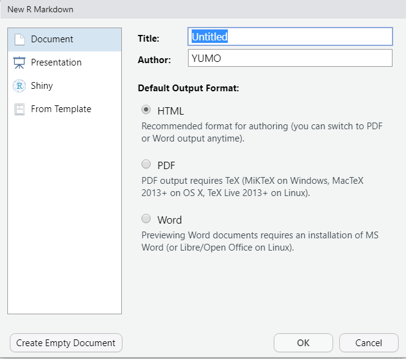

# Learning Objectives {.unnumbered}

-   Learn how to use R Markdown to write an academic report.

```{r setup, message= FALSE, warning = FALSE, echo=FALSE}
knitr::opts_chunk$set(echo = TRUE, cache = FALSE, warning = FALSE, message = FALSE)
```

# R Markdown Introduction

This is an R Markdown document. Markdown is a simple formatting syntax for authoring **HTML**, **PDF**, and **MS Word** documents. To learn more details on using [R Markdown](http://rmarkdown.rstudio.com), please refer to [R Markdown Cookbook](https://bookdown.org/yihui/rmarkdown-cookbook/) and [R Markdown: The Definitive Guide](https://bookdown.org/yihui/rmarkdown/). After attending this Lab session, students are expected to learn basic skills in writing documents using R Markdown.

There are many advantages to use R Markdown in your work. An important benefit is that it allows your R code and/or its outputs to be directly embedded into formatted documents for communication and provides quick and **reproducible** reporting from *R*. However, when using *Latex* or *Word* to write a paper or assignment, the codes and data are run in a separate place and you need to manually insert all outputs, such as figures and tables, into the document. And when there is a change of results due to the change of data or code, you need to update all related outputs manually in your report, which can be time consuming and easy to make mistakes. However, R Markdown allows all outputs to be automatically updated when there is a change. Another advantage is that it is incredibly easy to use. R Markdown uses simple syntax and can be learned quickly.

## Installation

Before you install R Markdown, you need have R and RStudio downloaded. First, to install R, go to this link [R](https://cloud.r-project.org/). Remember to choose a correct version for your system. Then, to install RStudio, go to this link, [RStudio](https://rstudio.com/products/rstudio/download/#download). Also remember to install a correct version for your system.

Now open RStudio to install R Markdown. R Markdown files are designed to be used with the `rmarkdown` package. rmarkdown comes installed with the RStudio IDE, but you can acquire your own copy of rmarkdown from CRAN with the command.

```{r}
# install.packages("rmarkdown")
```

*Note: RStudio does not build PDF and Word documents from scratch. You will need to have a distribution of Latex installed on your computer to make PDFs and Microsoft Word (or a similar program) installed to make Word files.*

According to the [R Markdown Cook Book](https://bookdown.org/yihui/rmarkdown-cookbook/install-latex.html),

"If you would like to create PDF documents from R Markdown, you will need to have a LaTeX distribution installed. Although there are several traditional options including MiKTeX, MacTeX, and TeX Live, we recommend that R Markdown users install TinyTeX."

```{r}
#To install TinyTex, uncomment and run the following code
#tinytex::install_tinytex()

# to uninstall TinyTeX, uncomment and run the following code
#tinytex::uninstall_tinytex()
```

Open your R Studio, Click "File" -\> "New File" -\> "R Markdown". Then you will see this:

```{r window, out.width = "75%",fig.align='center'}

```

Here you can choose an output format, and *it's not important* because you can change the format anytime later.

## Knit & Convert

R Markdown files are the source code for rich, reproducible documents. You can transform an R Markdown file in two ways.

1.  **knit** - You can knit the file. The rmarkdown package will call the `knitr` package. `knitr` will run each chunk of R code in the document and append the results of the code to the document next to the code chunk. This workflow saves time and facilitates reproducible reports. Consider how authors typically include graphs (or tables, or numbers) in a report. The author makes the graph, saves it as a file, and then copy and pastes it into the final report. This process relies on manual labor. If the data changes, the author must repeat the entire process to update the graph. In the R Markdown paradigm, each report contains the code it needs to make its own graphs, tables, numbers, etc. The author can automatically update the report by re-knitting.

2.  **convert** - You can convert the file. The rmarkdown package will use the pandoc program to transform the file into a new format. For example, you can convert your '.Rmd' file into an HTML, PDF, or Microsoft Word file. You can even turn the file into an HTML5 or PDF slideshow. rmarkdown will preserve the text, code results, and formatting contained in your original .Rmd file. Conversion lets you do your original work in markdown, which is very easy to use. You can include R code to knit, and you can share your document in a variety of formats.

In practice, authors almost always **knit and convert** their documents at the same time. In this article, I will use the term render to refer to the two step process of knitting and converting an R Markdown file.

```{=tex}
\begin{taskbox}
\textbf{Task:} Knit the empty template called `template.Rmd` and review the output.
\end{taskbox}
```
## Three Frameworks

R Markdown reports rely on three frameworks.

1.  markdown for formatted text.
2.  `knitr` for embedded R code.
3.  YAML for render parameters.

### Markdown for Formatted Text

Markdown is a set of conventions for formatting plain text. You can use markdown to indicate

-   **bold** and *italic* text: Surround italicized text with asterisks, like this *without realizing it*. Surround bold text with two asterisks, like this **easy to use**.

-   lists: Group lines into bullet points that begin with asterisks. Leave a blank line before the first bullet.

-   headers (e.g., section titles): Place one or more hashtags at the start of a line that will be a header (or sub-header). For example, \# Say Hello to markdown. A single hashtag creates a first level header. Two hashtags, ##, creates a second level header, and so on.

-   hyperlinks: [Github](www.github.com), [StackOverflow](www.stackoverflow.com), [Reddit](www.reddit.com)

-   and much more

The conventions of markdown are very unobtrusive, which make Markdown files easy to read. The file below uses several of the most useful markdown conventions.

To access a quick guide, click -\> "Help" -\> "Markdown Quick Reference". RStudio will open the Markdown Quick Reference guide in the Help pane.

A more comprehensive guide can be found, click -\> "Help" -\> "Cheatsheets" -\> "R Markdown Cheat Sheet".

### `knitr` for embedded R code

The `knitr` package extends the basic markdown syntax to include chunks of executable R code.

When you render the report, `knitr` will run the code and add the results to the output file. You can have the output display just the code, just the results, or both.

To embed a chunk of R code into your report, surround the code with two lines that each contain three backticks. After the first set of backticks, include `{r}`, which alerts `knitr` that you have included a chunk of R code. A shortcut to embed a chunk is to press "**ALT + CTRL + I**". The result will look like this

```{r chunk 1}
dim(iris) # Retrieve or set the dimension of an object.
iris[3,1] # The object at row 3 co
```

### YAML for render parameters

`title`: "your awesome title" `author`: "your name" `date`: "today" or type any time you want.

The `output`: value determines what type of output to convert the file into when you call rmarkdown::render(). Note: you do not need to specify output: if you render your file with the RStudio IDE knit button.

`output`: recognizes the following values:

-   `html_document`, which will create HTML output (default)
-   `pdf_document`, which will create PDF output
-   `word_document`, which will create Word output

You can also use the output: value to render your document as a slideshow.

`output: ioslides_presentation` will create an ioslides (HTML5) slideshow `output: beamer_presentation` will create a beamer (PDF) slideshow

However, you can see the output of this file is `bookdown::html_document2`( a bookdown output format).

The reason is that cross-referencing is not provided directly within the base rmarkdown package, but is provided as an extension in bookdown. We must therefore use an output format from bookdown (e.g., `html_document2`, `pdf_document2`, and \``word_document2`,etc.) in the YAML output field. We will talk about cross-referencing in the last section.

Now let me illustrate this template of header in detail. You can create a cool template yourself. Here is good resource for learning (<https://bookdown.org/yihui/rmarkdown/>).

You can add a table of contents (TOC) using the `toc` option and specify the depth of headers that it applies to using the `toc_depth` option. For example:

`toc: yes`

`toc_depth`: '3'

You can add section numbering to headers using the `number_sections` option:

`number_sections: yes`

`fig_caption=yes` controls whether figures are rendered with captions.

`code_folding: hide` : hide option enables you to include R code but have it hidden by default. Users can then choose to show hidden R code chunks either individually or document wide. You can specify `code_folding: show` to still show all R code by default but then allow users to hide the code if they wish. **How to do it? I will show you in the next section.**

#### Rendering

To transform your markdown file into an HTML, PDF, or Word document, click the "Knit" icon that appears above your file in the scripts editor. A drop down menu will let you select the type of output that you want. Let's try all of them. A shortcut for Windows is to press "**SHIFT + CTRL +K**". (The short-cut to render in mac is **SHIFT+COMMAND+K**)

When you click the button, `rmarkdown` will duplicate your text in the new file format. `rmarkdown` will use the formatting instructions that you provided with markdown syntax. Once the file is rendered, RStudio will show you a preview of the new output and save the output file in your working directory.

### **Task: change the output to html and Knit it**

Hint: go to the header (top).

## Chunks

Now, you are familiar with R Markdown and it's time to practice. R Markdown is a variant of Markdown that has embedded **R code chunks**, to be used with `knitr` to make it easy to create reproducible web-based reports.

### Code chunks

Now, let's use "CTRL + ALT + I" to create an empty chunk. (A shortcut to embed a chunk is in mac is **OPTION+COMMAND+I**)

It's usually best to give each code chunk a name, like `simulate-data` above. The name is optional; if included, each code chunk needs a distinct name. The advantage of giving each chunk a name is that it will be easier to understand where to look for errors, should they occur. Also, any figures that are created will be given names based on the name of the code chunk that produced them.

### Chunk options

The initial line in a code chunk may include various options.

-   `echo=FALSE` indicates that the code will not be shown in the final document (though any results/output would still be displayed). Remember in the header we already set `code_folding: hide`. If you want to show codes for specific chunk you can set `echo=TRUE` for that chunk.

-   You use `results='hide'`to hide the results/output (but here the code would still be displayed).

-   You use `include=FALSE` to have the chunk evaluated, but neither the code nor its output displayed. If I'm writing a report for a collaborator, I'll often use `include=FALSE` to suppress all of the code and largely just include figures.

-   `warning=FALSE` and `message=FALSE` suppress any R warnings or messages from being included in the final document.

```{r simulate-data2, echo=TRUE, results='hide', include=TRUE, warning=FALSE}
set.seed(123)
x <- rnorm(100) # 100 random variables from a standard normal distribution
y <- 2*x + rnorm(100)
cor(x, y)
```

For figures, you'll want to use options like `fig.width` and `fig.height`. You can see the output of this particular chunk by clicking the "green play button" called *Run Current Chunk*. Have a try here:

```{r scatterplot, fig.width=5, fig.height=4, fig.cap="Scatterplot"}
plot(x,y)
```

Note that if `include=FALSE`, all of the code, results, and figures will be suppressed. If `include=TRUE` and `results="hide"`, the results will be hidden but figures will still be shown. To hide the figures, use `fig.show="hide"`.

If you want to add an image that is not produced within Rmarkdown. This can be done by using .

**BUT!** A better way to add an image is using `include_graphics():`

```{r UNSW, fig.align='center', out.width = "50%", fig.cap="Welcome to UNSW"}

```

The advantage is obvious, you can align the figure, change it size, add a caption, cross-reference it..... It's all about chunk options.

There are lots of chunk options here [Chunk options and package options](https://yihui.org/knitr/options/#chunk_options).

### Global chunk options

You may be inclined to use largely the same set of chunk options throughout a document. But it would be a pain to retype those options in every chunk. Thus, you want to set some global chunk options at the top of your document.

For example, I might use `include=FALSE` or at least `echo=FALSE` globally for a report to a scientific collaborator who wouldn't want to see all of the code. And I might want something like `fig.width=12` and `fig.height=6` if I generally want those sizes for my figures.

I'd set such options by having an initial code chunk like this:

```{r global-options, include=FALSE}
knitr::opts_chunk$set(fig.width=6, fig.height=6, fig.path='Figs/', warning=FALSE, message=FALSE,fig.align='center')
```

`fig.path='Figs/'` makes it so the figure files get placed in the Figs subdirectory. (By default, they are not saved at all.)

**Note**: the ending slash in `Figs/` is important. If you used `fig.path='Figs'` then the figures would go in the main directory but with Figs as the initial part of their names.

The global chunk options become the defaults **for the rest of the document**. Then if you want a particular chunk to have a different behavior, for example, to have a different figure height, you'd specify a different option within that chunk. For example:

```{r a-taller-figure, fig.height=6,fig.cap= "Multiple plots"}
par(mfrow=c(2,2))
for(i in 1:4){
  
plot(x[(1:25)*i], y[(1:25)*i])
  
}
```

In a report to a collaborator, I might use `include=FALSE, echo=FALSE` as a global option, and then use `include=TRUE` for the chunks that produce figures. Then the code would be suppressed throughout, and any output would be suppressed except in the figure chunks (where I used `include=TRUE`), which would produce just the figures.

### Package options

In addition to the chunk options, there are also package options, set with something like:

```{r package-options, include=FALSE}
knitr::opts_knit$set(progress = TRUE, verbose = TRUE)
```

-   `progress: (TRUE; logical)`: Whether to display a progress bar when running `knitr::knit()`.

-   `verbose: (FALSE; logical)`: Whether to show verbose information (e.g., R code in each chunk and message logs), or only show chunk labels and options.

Personally, I don't usually set package options.

### Reproducible!

A key motivation for knitr is reproducible research: that our results are accompanied by the data and code needed to produce them. Thus, your report should never explicitly include numbers that are derived from the data. Don't write "There are 500 simulations." Rather, insert a bit of code that, when evaluated, gives the number of individuals.

That's the point of the **in-line code**. You'd write something like this: There are `r length(x)` individuals.

Another example: The estimated correlation between x and y was `r cor(x,y)`. In R Markdown, in-line code is indicated with `r`. The bit of R code between them is evaluated and the result inserted.

**An important point**: you need to be sure that these in-line bits of code aren't split across lines in your document. Otherwise you'll just see the raw code and not the result that you want.

## Cross-referencing within documents

To use cross-references, you will need:

-   A bookdown output format: Cross-referencing is not provided directly within the base rmarkdown package, but is provided as an extension in bookdown. We must therefore use an output format from bookdown (e.g., `html_document2`, `pdf_document2`, and `word_document2`, etc.) in the YAML `output` field.

-   A caption to your figure (or table): Figures without a caption will be included directly as images and will therefore not be a numbered figure.

-   A labeled code chunk: This provides the identifier for referencing the figure generated by the chunk.

Let's try to change the `output` to `bookdown::html_document2: default` and `bookdown::pdf_document2: default`. After these conditions are met, we can make cross-references within the text using the syntax \@ref(type:label), where label is the chunk label and type is the environment being referenced (e.g. tab, fig, or eqn).

See examples

-   Figure \@ref(fig:scatterplot) and Figure \@ref(fig:a-taller-figure).

-   Table \@ref(tab:mtcars).

```{r mtcars, echo=FALSE}
knitr::kable(mtcars[1:5, 1:5], caption = "The mtcars data.")
```

-   Equation \@ref(eq:mean)

```{=tex}
\begin{equation}
\bar{X} = \frac{\sum_{i=1}^n X_i}{n} (\#eq:mean)
\end{equation}
```
We demonstrate a few more math equation environments below. Here is an unnumbered equation using the `equation*` environment (see this equation is not numbered):

```{=tex}
\begin{equation*} 
\frac{d}{dx}\left( \int_{a}^{x} f(u)\,du\right)=f(x)
\end{equation*}
```
Below is an `align` environment, which allows you to align equal sign (or other signs you want):

```{=tex}
\begin{align} 
g(X_{n}) &= g(\theta)+g'({\tilde{\theta}})(X_{n}-\theta) \notag \\
\sqrt{n}[g(X_{n})-g(\theta)] &= g'\left({\tilde{\theta}}\right)
  \sqrt{n}[X_{n}-\theta ] (\#eq:align)
\end{align}
```
You can use the `split` environment inside `equation` so that all lines share the same number \@ref(eq:var-beta). By default, each line in the align environment will be assigned an equation number. We suppressed the number of the first line in the previous example using `\notag`. In this example, the whole split environment was assigned a single number:

```{=tex}
\begin{equation} 
\begin{split}
\mathrm{Var}(\hat{\beta}) & =\mathrm{Var}((X'X)^{-1}X'y)\\
 & =(X'X)^{-1}X'\mathrm{Var}(y)((X'X)^{-1}X')'\\
 & =(X'X)^{-1}X'\mathrm{Var}(y)X(X'X)^{-1}\\
 & =(X'X)^{-1}X'\sigma^{2}IX(X'X)^{-1}\\
 & =(X'X)^{-1}\sigma^{2}
\end{split}
(\#eq:var-beta)
\end{equation}
```
You can even reference a section in your report.

## your amazing header {#label-section}

Then I can refer to Section \@ref(label-section).

## Citations

There are 5 steps to cite literature and create a Reference section at the end of this file. Here is a good resource if you want to learn other ways of references. (<https://rmarkdown.rstudio.com/authoring_bibliographies_and_citations.html#Inline_References>)

1.  **Creating a new bibliography file**: Create a ".bib" file in the same path with this Rmd file. I use TexMaker to create an empty file called "refWeek1.bib". You can also create a ".bib" file in R Studio. Click "File" -\> "New file" -\> "R Script". Then save it as "refWeek1.bib".

2.  **Fill in this file**: Go to (<https://scholar.google.com/>) and search the literature. e.g. "Handbook of data visualization". Click **Citation**, then choose **BibTex**. Copy the citation details and paste it to "refWeek1.bib". Click *Save*. Now "refWeek1.bib" is completed and we need to import this file in R Markdown. (If you want cite something without online **BibTex** source, you can write it yourself in "refWeek1.bib")

3.  **Specifying a bibliography**: Go back to YAML header (top) of this Rmd file. Type "bibliography: refWeek1.bib". This command is used to import "refWeek1.bib" we just created.

4.  **Inline references**: To cite the literature we need use command "\@name". The "name" is the words before the first comma in "refWeek1.bib", which is "chen2007handbook". Normally, we don't change the name. @chen2007handbook

5.  **Bibliography placement**: If you want a reference list at the end of this Rmd file, you only need to type "\# Reference".

```{=tex}
\begin{taskbox}
\textbf{Task:} Cite the book "An Introduction to Statistical Learning."

You are supposed to cite it here. (Hint: you can start from step 2)
\end{taskbox}
```
## Comment

You can add the command if you want to comment any text in the Rmarkdown using the commands. (Check the command in the Rmd file)

```{=html}
<!---
I do not want this text to be displayed to the public. 
--->
```
## Visual Markdown Editor

The visual editor is friendly to those who are not familiar with Markdown yet, or do not prefer writing Markdown code (see [R Markdown Cookbook](https://bookdown.org/yihui/rmarkdown-cookbook/rstudio-visual.html)) . It was experimental in earlier versions of RStudio, and starting with RStudio v2022.02, you can switch between the source mode and the visual mode for a markdown document by simply clicking the "Visual" or "Source" button[^1] located on the left side of the editor toolbar (see the [blog post](https://www.rstudio.com/blog/exploring-rstudio-visual-markdown-editor/)). To learn more, you can refer to RStudio's introduction to Visual R Markdown (see <https://rstudio.github.io/visual-markdown-editing/>).

[^1]: If you don't see this, please update RStudio to the latest version.

```{=tex}
\begin{taskbox}
\textbf{Task:} As an exercise, you can experiment with the following features of the visual editor:
\begin{itemize}
  \item Format: \textbf{bold}, \textit{italic}, \underline{underline}, \texttt{code}, super\textsuperscript{script}, sub\textsubscript{script}, etc.
  \item Headers: 1st-level header, 2nd-level header... 6th-level header
  \item Hyperlinks
  \item Lists (bulleted list or numbered list)
  \item Insert: citation, cross-reference (figures, tables, equations), footnote, in-line comment.
  \item And so on.
\end{itemize}
\end{taskbox}
```
<!-- -   Format: **bold**, *italic*, [underline,]{.underline} `code`, super^script^, sub~script~, etc. -->

<!-- -   Headers: 1st-level header, 2nd-level header... 6th-level header -->

<!-- -   Hyperlinks -->

<!-- -   Lists (bulleted list or numbered list) -->

<!-- -   Insert: citation, cross-reference (figures, tables, equations), footnote, (in-line) comment. -->

<!-- -   and so on. -->

In general, this visual editor makes document editing just like in Word. However, it sometimes conflicts with other packages (from my personal experience - in YAML header or LaTeX equations; and there are other causes of problems or limitations, as this editor is still under development!), so **you must be very careful** when using this editor.

# Reference
